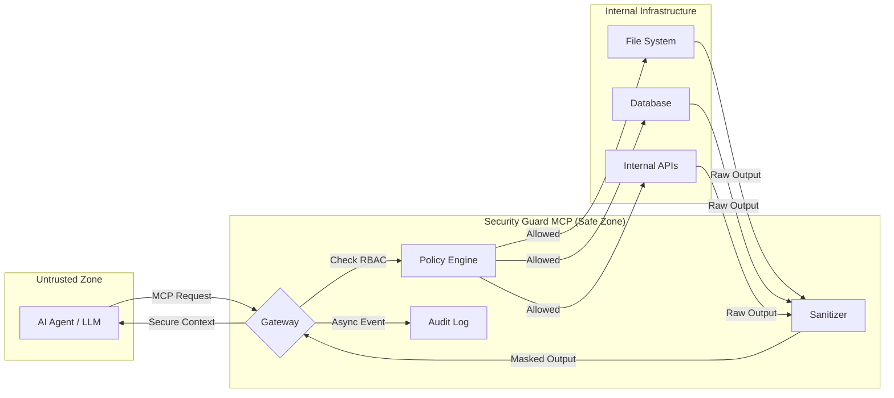
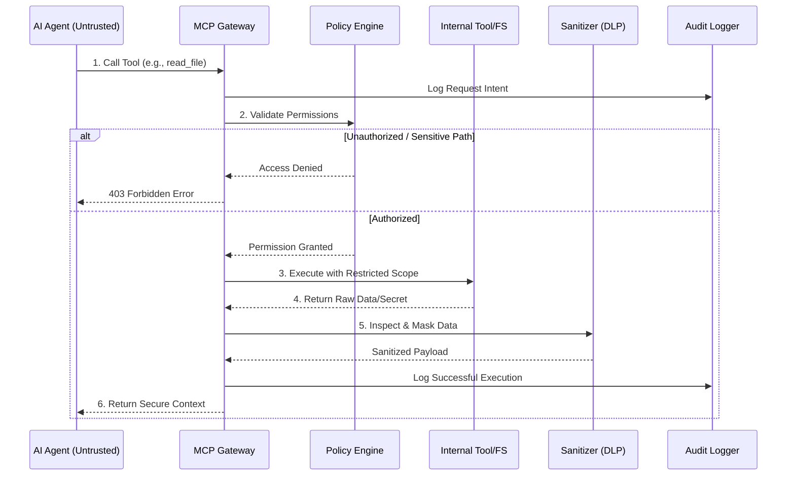
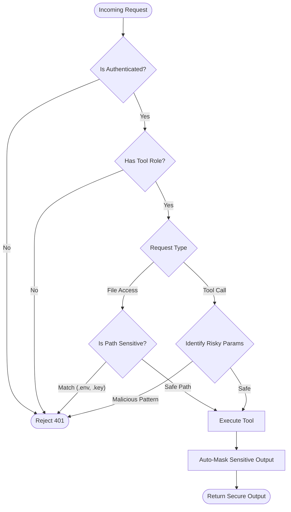
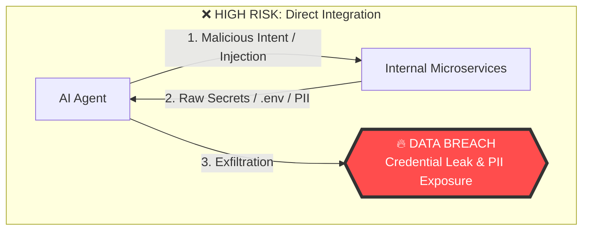
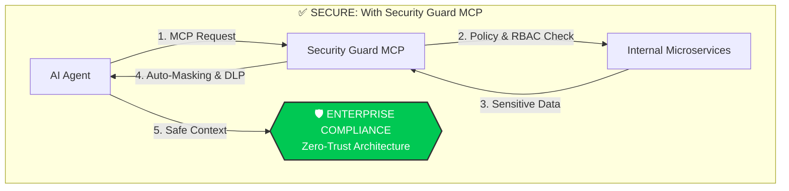

# 🛡️ Security Guard MCP

[](https://opensource.org/licenses/MIT)
[](https://nestjs.com/)
[](https://modelcontextprotocol.io/)

**Security Guard MCP** is an enterprise-grade security gateway designed specifically for the **Model Context Protocol (MCP)**. It acts as a zero-trust intermediary between Large Language Models (LLMs) and MCP tools, ensuring that every interaction is audited, sanitized, and compliant with corporate security policies.

---

## 🌟 Overview

As LLMs gain the ability to execute tools and access local/remote contexts via MCP, the risk of accidental data leakage or unauthorized system access increases. Security Guard MCP provides a robust defense layer that:

- **Prevents Exfiltration**: Automatically masks sensitive data (API keys, tokens, passwords) from tool outputs.
- **Enforces Least Privilege**: Implements RBAC and granular policy control over tool execution.
- **Secures the File System**: Blocks access to sensitive system files and configuration directories.
- **Ensures Accountability**: Logs every tool call and context exchange for audit and compliance.

---

## 🤖 For AI Agent Developers

If you are building AI Agents (using LangChain, AutoGPT, or custom MCP clients), **Security Guard MCP** solves the "Trust Gap" between your agent and your infrastructure. 

### Why use this?
When you give an AI Agent a tool (e.g., "Read File" or "Execute SQL"), you are essentially giving it a "shell" into your environment. Security Guard MCP ensures:
*   **Prompt Injection Defense**: Filters malicious intent before it reaches your sensitive tools.
*   **Context Isolation**: Limits what the agent can "see" and "touch" based on strictly defined scopes.
*   **Safe Experimentation**: Developers can test autonomous agents without worrying about them accidentally deleting data or leaking `.env` files.

### 🚀 Key Use Cases

#### 1. Microservices Development
When using AI agents to navigate complex microservice architectures:
*   **Service Discovery Protection**: Prevents agents from probing internal endpoints they aren't authorized to access.
*   **Credential Shielding**: Automatically masks internal service-to-service tokens and Kafka credentials in the agent's context.

#### 2. Frontend & Web Development
Protecting your UI/UX workflow:
*   **Source Code Privacy**: Allows agents to help with CSS/UI logic while blocking access to sensitive API configurations or `.env` files.
*   **Proprietary Logic Shield**: Sanitizes internal business logic or intellectual property from being sent back to the LLM provider's training sets.

#### 3. Data Engineering & SQL Agents
For agents with database tool access:
*   **PII Scrubbing**: Dynamically masks Personal Identifiable Information (PII) from SQL query results before the agent processes them.
*   **Query Guardrails**: Works with the Policy Engine to block destructive commands (DROP, TRUNCATE) even if the agent is "convinced" to run them via prompt injection.

### 🔄 The Security Flow

#### 1. High-Level Architecture


#### 2. Request Lifecycle (Deep Dive)


#### 3. Policy Decision Logic


#### 4. The Risk: Direct Integration vs. Security Gateway
This diagram illustrates the critical "Trust Gap" and the high risk of exposure when AI Agents are integrated without a security intermediary.



---

## 🏗️ Architecture

Built on a modular **NestJS Monorepo** architecture, the project is divided into specialized micro-services and libraries:

### Applications
- **Gateway (`apps/gateway`)**: The main entry point. Handles incoming MCP requests, performs authentication, and dispatches tasks through the security pipeline.

### Core Libraries
- **`libs/sanitizer`**: Deep-content inspection engine for auto-masking sensitive strings.
- **`libs/scanner`**: Security scanner for file path validation and protocol-level threat detection.
- **`libs/policy`**: Policy engine for RBAC and dynamic tool-access rules.
- **`libs/auth`**: Unified authentication layer.
- **`libs/audit`**: High-performance audit logging via Kafka.

---

## 🛡️ Security Controls

### 1. Auto-Masking (DLP)
The system automatically detects and masks sensitive keys in JSON payloads and tool responses, including:
- `password`, `secret`, `token`, `apikey`, `privateKey`, `clientSecret`.

### 2. File System Protection
Protects the host environment by blocking access to:
- **Configurations**: `.env*`, `application-prod.yml`, `terraform.tfvars`
- **Credentials**: `*.pem`, `*.key`, `id_rsa`, `known_hosts`, `secrets/*`
- **Certificates**: `*.p12`, `*.jks`

### 3. Enterprise Features
- **Audit Logging**: Asynchronous logging to **Kafka** for long-term retention and SIEM integration.
- **Observability**: Native **OpenTelemetry** support for distributed tracing and Prometheus metrics.
- **High Performance**: Built on **Fastify** for ultra-low latency security overhead.

---

## 🛠️ Tech Stack

- **Framework**: [NestJS](https://nestjs.com/) + [Fastify](https://www.fastify.io/)
- **Protocol**: [Model Context Protocol SDK](https://github.com/modelcontextprotocol/sdk)
- **Database**: [PostgreSQL](https://www.postgresql.org/) with [Prisma ORM](https://www.prisma.io/)
- **Caching**: [Redis](https://redis.io/) (ioredis)
- **Messaging**: [Apache Kafka](https://kafka.apache.org/) (kafkajs)
- **Validation**: [Zod](https://zod.dev/)

---

## 🚀 Getting Started

### Prerequisites
- Node.js v20+
- Docker & Docker Compose
- A running MCP-compatible Client (e.g., Claude Desktop, Gemini CLI)

### Installation
1. **Clone the repository**:
   ```bash
   git clone https://github.com/your-org/security-guard-mcp.git
   cd security-guard-mcp
   ```

2. **Install dependencies**:
   ```bash
   npm install
   ```

3. **Environment Setup**:
   ```bash
   cp .env.example .env
   # Update .env with your local database and Kafka credentials
   ```

4. **Spin up Infrastructure**:
   ```bash
   docker compose up -d
   ```

5. **Run the Application**:
   ```bash
   # Development mode
   npm run start:dev

   # Production build
   npm run build
   npm run start:prod
   ```

---

## 📄 License

This project is licensed under the **MIT License** - see the [LICENSE](LICENSE) file for details.
